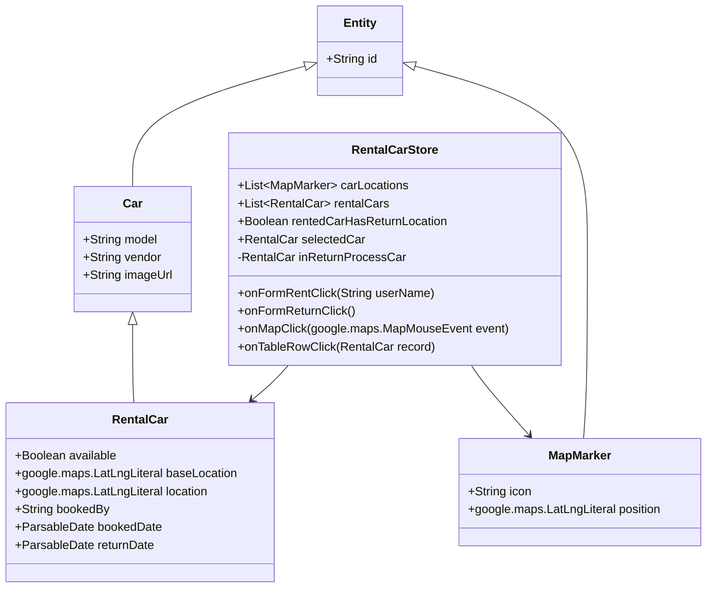

# Class Diagram

```mermaid
classDiagram
    Entity <|-- Car
    Entity <|-- MapMarker
    Car <|-- RentalCar
    RentalCarStore --> RentalCar
    RentalCarStore --> MapMarker

    class Entity{
      +String id
    }

    class Car{
      +String model
      +String vendor
      +String imageUrl
    }

    class RentalCar{
      +Boolean available
      +google.maps.LatLngLiteral baseLocation
      +google.maps.LatLngLiteral location
      +String bookedBy
      +ParsableDate bookedDate
      +ParsableDate returnDate
    }

    class MapMarker {
       +String icon
       +google.maps.LatLngLiteral position
    }

    class RentalCarStore {
        +List~MapMarker~ carLocations
        +List~RentalCar~ rentalCars
        +Boolean rentedCarHasReturnLocation
        +RentalCar selectedCar
        -RentalCar inReturnProcessCar
        +onFormRentClick(String userName)
        +onFormReturnClick()
        +onMapClick(google.maps.MapMouseEvent event)
        +onTableRowClick(RentalCar record)
    }
```
