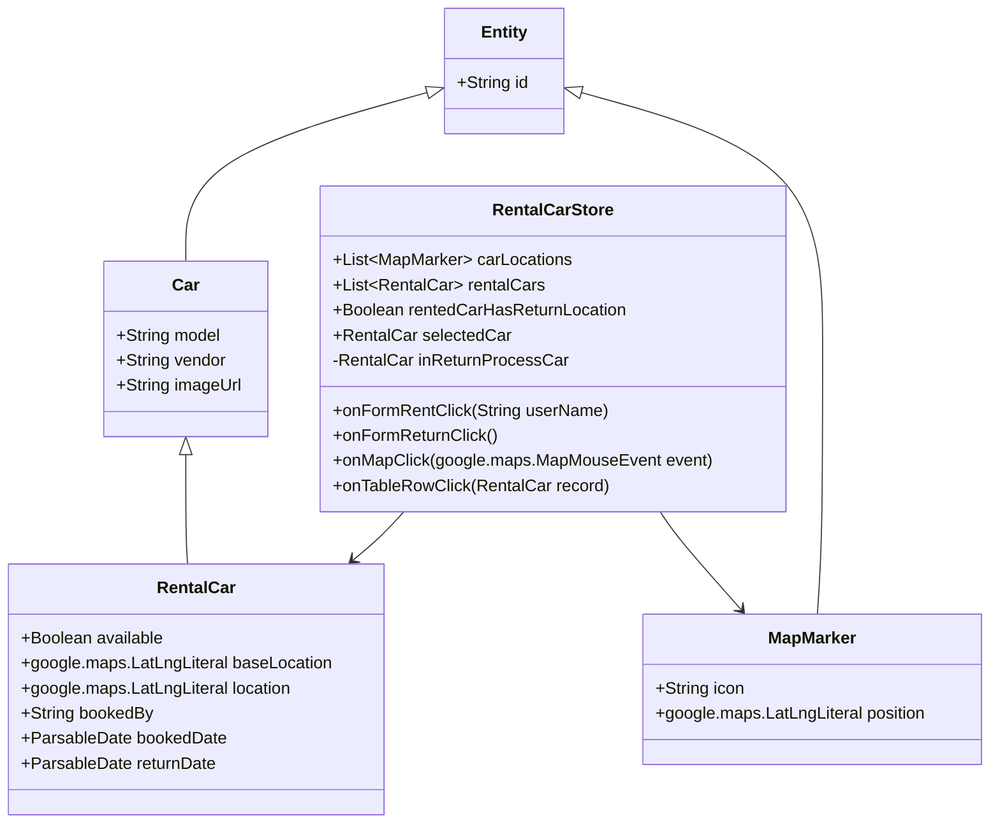
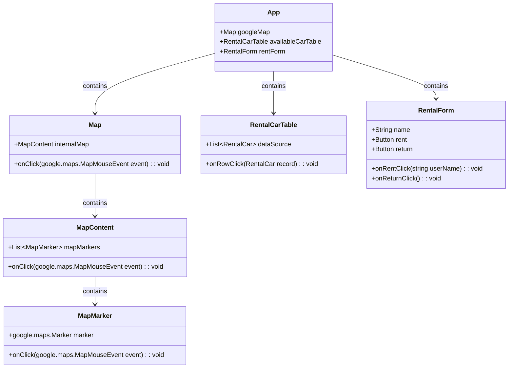

# Class Diagram

## Model Diagram

```mermaid
classDiagram
    class Entity{
      +String id
    }

    class Car{
      +String model
      +String vendor
      +String imageUrl
    }

    class RentalCar{
      +Boolean available
      +google.maps.LatLngLiteral baseLocation
      +google.maps.LatLngLiteral location
      +String bookedBy
      +ParsableDate bookedDate
      +ParsableDate returnDate
    }

    class MapMarker {
       +String icon
       +google.maps.LatLngLiteral position
    }

    class RentalCarStore {
        +List~MapMarker~ carLocations
        +List~RentalCar~ rentalCars
        +Boolean rentedCarHasReturnLocation
        +RentalCar selectedCar
        -RentalCar inReturnProcessCar
        +onFormRentClick(String userName)
        +onFormReturnClick()
        +onMapClick(google.maps.MapMouseEvent event)
        +onTableRowClick(RentalCar record)
    }

    Entity <|-- Car
    Entity <|-- MapMarker
    Car <|-- RentalCar
    RentalCarStore --> RentalCar
    RentalCarStore --> MapMarker
```

## Component Diagram

```mermaid
classDiagram
    class App {
        +Map googleMap
        +RentalCarTable availableCarTable
        +RentalForm rentForm
    }

    class Map {
        +MapContent internalMap
        +onClick(google.maps.MapMouseEvent event): void
    }

    class MapContent {
        +List~MapMarker~  mapMarkers
        +onClick(google.maps.MapMouseEvent event): void
    }

    class MapMarker {
        +google.maps.Marker marker
        +onClick(google.maps.MapMouseEvent event): void
    }

    class RentalCarTable {
        +List~RentalCar~ dataSource
        +onRowClick(RentalCar record): void
    }

    class RentalForm {
        +String name
        +Button rent
        +Button return
        +onRentClick(string userName): void
        +onReturnClick(): void
    }

    App --> Map : contains
    App --> RentalCarTable : contains
    App --> RentalForm : contains
    Map --> MapContent : contains
    MapContent --> MapMarker : contains
```
